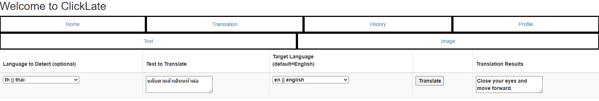
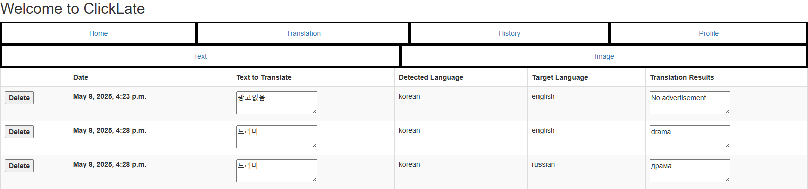
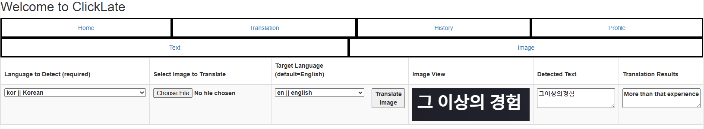
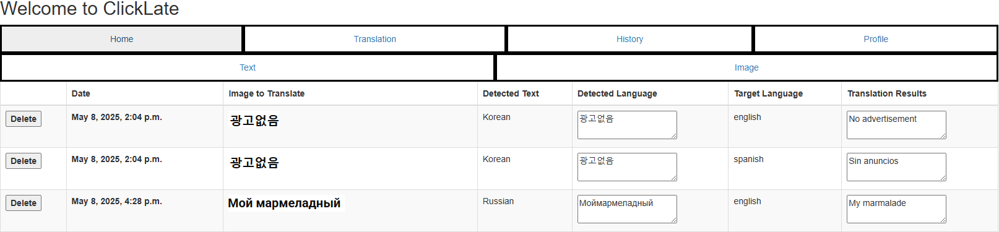
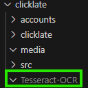
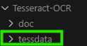
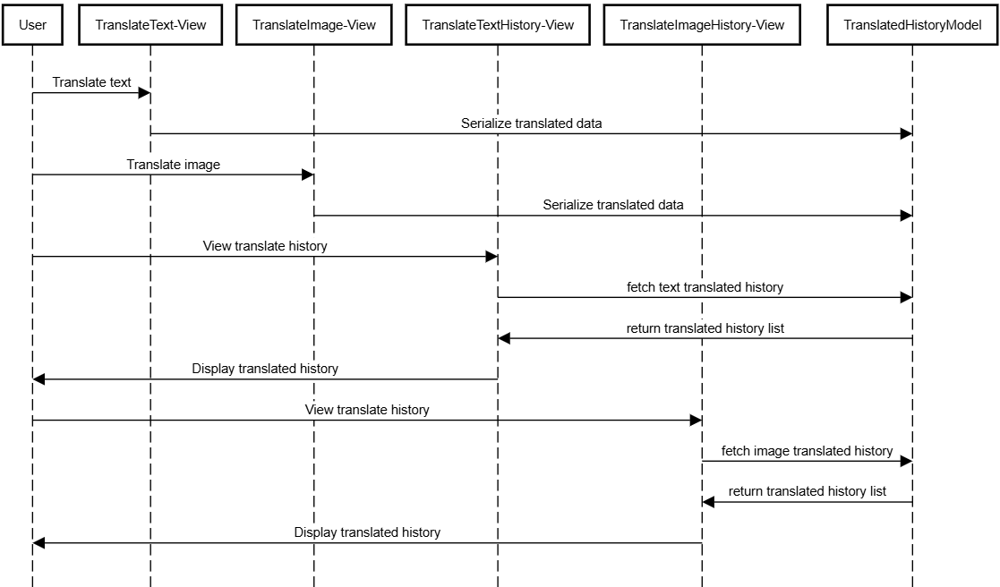

<h1 align="center">
  <br>
  Clicklate
  <br>
</h1>

<h4 align="center">A personalized translation web application suited for a traveler, translator, linguist, student and more.


<p align="center">
  <a href="#key-features">Key Features</a> •
  <a href="#screenshots">Screenshots</a> •
  <a href="#technology">Technology</a> •
  <a href="#how-to-use">How To Use</a> 
</p>

## Key Features

A website that provides profile preference for an individual who is learning a new language or utilizes language translations on a daily basis.

* Translate a text in any language to a different language
* Upload an image, scan the image for text characters, and translate the text into a different language 
* User registration, login, and profile update
* Review historical translation events

## Screenshots

### Translate Image


### Review Translated Text History


### Translate Image


### Review Translated Text History



## Technology

This application uses the following open source packages:

- [googletrans](https://pypi.org/project/googletrans/)
- [Tesseract-OCR](https://tesseract-ocr.github.io/tessdoc/Home.html) / [pytesseract](https://pypi.org/project/pytesseract/)

and is built on the following framework:
- [Django](https://www.djangoproject.com/)

## How To Use

```bash
# Create directory & navigate to directory
mkdir a_project_name
cd a_project_name

# Install Django
py install django

# Start up virtual environment
py -m venv venv
venv/Scripts/activate

# Clone this repository
git clone https://github.com/yasilievy/SEIS-739-Click-Late.git

# Install dependencies
py -m pip install pytesseract
py -m pip install googletrans
```

You will need to download [Tesseract-OCR](https://github.com/tesseract-ocr/tesseract/releases/download/5.5.0/tesseract-ocr-w64-setup-5.5.0.20241111.exe) and install the application in the same directory of git cloned directory <br>
<br>
Next, download the [tessdata](https://github.com/tesseract-ocr/tessdata) and replace the existing tessdata folder in the Tesseract-OCR folder <br>
<br>


```bash
# Go into the repository
cd SEIS-739-Click-Late

# Run the app
$ py manage.py runserver
```

## Project Report

### Architecture
In this project, I decided to use Django Python Web Framework to create the frontend, backend, and database.
The application provides user authentication and profile management mechanics which solely relies on Django's preset User model authentication.
Several custom forms are created to handle simplified CRUD functions with the view rendering of basic HTML template implementation.
The second core mechanic utilizes one custom model that represents the historical transation events and one serializer to perform CRUD functions to capture when a user translate an image or text.
The text translation accessibility is possible with the googletrans library and the image translation accessibility is possible with the combination of googletrans library and pytesseract library.
Again with view rendering of basic HTML template implementation, it was possible to compose a frontend that communicates with the default SQLITE3 database.

#### Sequence Diagram


### Challenges
This was an exciting project to work with as it mainly explores Django's powerful quick and fast web development. However, there were some difficulties with creating dynamic user interface as ikt was difficult to implement Javascript with Django. I also faced natural difficulties with HTML and CSS as it is another set of practices to work with the syntax and learn differnt style availabilities and approches. This was definitly a result of a one-man team. 